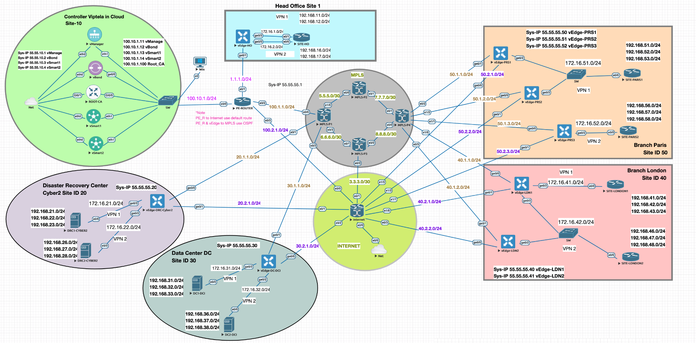
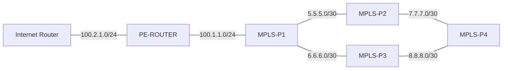

# Phase 1 — SD-WAN Underlay Infrastructure

## Objective

Phase 1 builds the IP/MPLS underlay required before the SD-WAN control plane is introduced.

The technical goals are:

- establish Internet-side reachability,
- build the MPLS backbone,
- form OSPF Area 0 adjacencies,
- establish LDP sessions across the core,
- verify MPLS forwarding,
- validate end-to-end underlay connectivity.

## Full Lab Topology

> Phase 1 focuses on the underlay infrastructure: Internet Router, PE-ROUTER and the MPLS P1–P4 backbone. Controller, branch, data-center and vEdge components are shown only for full-lab context and are introduced in later phases.

> **Scope note:** This image shows the full SD-WAN lab as it exists across later phases.  
> Phase 1 focuses only on the underlay portion: Internet Router, PE-ROUTER and the MPLS P1–P4 backbone.  
> Controller, vEdge, branch and data-center elements are shown for overall context but are not treated as Phase 1 configuration evidence.

## Core Topology

This diagram intentionally shows only the **Phase 1 core links retained in the reconstructed configuration**.

## Device Roles

| Device | Phase 1 role |
|---|---|
| Internet Router | External-facing interface, default route, PE reachability |
| PE-ROUTER | Internet handoff, OSPF participation, MPLS/LDP edge of the provider core |
| MPLS-P1 | Core aggregation between PE, P2 and P3 |
| MPLS-P2 | Core transit toward P4 |
| MPLS-P3 | Core transit toward P4 |
| MPLS-P4 | Far-side core node used for end-to-end backbone validation |

## Addressing Used in the Reconstructed Core

| Link / Interface | Address |
|---|---|
| Internet Router ↔ PE | 100.2.1.2 / 100.2.1.1 |
| PE ↔ P1 | 100.1.1.1 / 100.1.1.2 |
| P1 ↔ P2 | 5.5.5.1 / 5.5.5.2 |
| P1 ↔ P3 | 6.6.6.1 / 6.6.6.2 |
| P2 ↔ P4 | 7.7.7.1 / 7.7.7.2 |
| P3 ↔ P4 | 8.8.8.1 / 8.8.8.2 |
| P1 Loopback | 2.2.2.1/32 |
| P2 Loopback | 2.2.2.2/32 |
| P3 Loopback | 2.2.2.3/32 |
| P4 Loopback | 2.2.2.4/32 |

## Implementation Order

1. Configure Internet-side connectivity.
2. Configure PE-ROUTER and its default route.
3. Enable OSPF and MPLS/LDP on the PE/core path.
4. Configure P1 and P2.
5. Extend the core through P3 and P4.
6. Verify OSPF, LDP and MPLS forwarding.
7. Perform reachability tests.

## Configuration Files

- [`configs/Internet-Router.cfg`](configs/Internet-Router.cfg)
- [`configs/PE-ROUTER.cfg`](configs/PE-ROUTER.cfg)
- [`configs/MPLS-P1.cfg`](configs/MPLS-P1.cfg)
- [`configs/MPLS-P2.cfg`](configs/MPLS-P2.cfg)
- [`configs/MPLS-P3.cfg`](configs/MPLS-P3.cfg)
- [`configs/MPLS-P4.cfg`](configs/MPLS-P4.cfg)

## Verification

See:

- [`verification/phase1-checklist.md`](verification/phase1-checklist.md)
- [`verification/observed-core-state.md`](verification/observed-core-state.md)

## Important Scope Note

The live lab has progressed beyond Phase 1. Current devices therefore contain routes, interfaces, adjacencies and policies introduced later.

The files here are intentionally filtered to show the Phase 1 underlay only.

See [`docs/reconstruction-notes.md`](docs/reconstruction-notes.md) for the evidence and exclusion rules.
