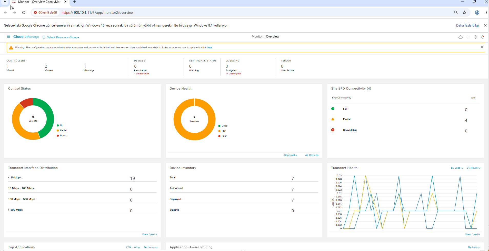
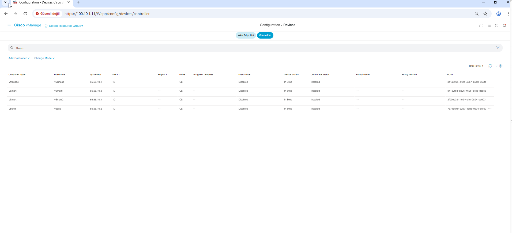

# Phase 2 — Verification Results

This section summarizes the verification results for the Phase 2 SD-WAN controller deployment.

Phase 2 focuses on controller system configuration, VPN 0 / VPN 512 connectivity, basic IP reachability and vManage GUI access.

Certificate installation and controller onboarding are handled separately in Phase 3.

## Controller Identity Verification

| Controller | System IP | Site ID | Organization | Status |
|---|---|---:|---|---|
| vManage | 55.55.10.1 | 10 | appbee-sdwan-project | ✅ Verified |
| vBond | 55.55.10.2 | 10 | appbee-sdwan-project | ✅ Verified |
| vSmart1 | 55.55.10.3 | 10 | appbee-sdwan-project | ✅ Verified |
| vSmart2 | 55.55.10.4 | 10 | appbee-sdwan-project | ✅ Verified |

## Transport Network — VPN 0

| Controller | Interface | Transport IP | State |
|---|---|---|---|
| vManage | eth1 | 100.10.1.11/24 | ✅ Up / Up |
| vBond | ge0/0 | 100.10.1.12/24 | ✅ Up / Up |
| vSmart1 | eth1 | 100.10.1.13/24 | ✅ Up / Up |
| vSmart2 | eth1 | 100.10.1.14/24 | ✅ Up / Up |

The current live lab uses the PE Router transport address `100.10.1.10` as the default next hop:

```text
0.0.0.0/0 → 100.10.1.10
```

## Management Network — VPN 512

| Controller | Interface | Management IP | State |
|---|---|---|---|
| vManage | eth0 | 100.10.1.11/24 | ✅ Up / Up |
| vBond | eth0 | 100.10.1.12/24 | ✅ Up / Up |
| vSmart1 | eth0 | 100.10.1.13/24 | ✅ Up / Up |
| vSmart2 | eth0 | 100.10.1.14/24 | ✅ Up / Up |

## vSmart1 Reachability

```text
vSmart1# ping 100.10.1.10
7 packets transmitted, 7 received, 0% packet loss

vSmart1# ping 100.10.1.12
6 packets transmitted, 6 received, 0% packet loss
```

✅ PE Router and vBond reachable.

## vSmart2 Reachability

```text
vSmart2# ping 100.10.1.10
3 packets transmitted, 3 received, 0% packet loss

vSmart2# ping 100.10.1.12
4 packets transmitted, 4 received, 0% packet loss
```

✅ PE Router and vBond reachable.

## vManage Reachability

```text
vManage# ping 100.10.1.10
4 packets transmitted, 4 received, 0% packet loss

vManage# ping 100.10.1.12
4 packets transmitted, 4 received, 0% packet loss

vManage# ping 100.10.1.13
5 packets transmitted, 5 received, 0% packet loss

vManage# ping 100.10.1.14
5 packets transmitted, 5 received, 0% packet loss
```

✅ PE Router, vBond, vSmart1 and vSmart2 reachable.

## vBond Reachability

vBond successfully reached the other controllers over VPN 0:

| Destination | Address | Result |
|---|---|---|
| vManage | 100.10.1.11 | ✅ 0% loss |
| vSmart1 | 100.10.1.13 | ✅ 0% loss |
| vSmart2 | 100.10.1.14 | ✅ 0% loss |

The vBond → PE Router test returned successful replies but was manually interrupted, so it is treated as reachability evidence rather than as a clean packet-loss benchmark.

## ARP Verification

ARP entries were observed for the PE Router and all controller transport addresses.

Example from vManage:

```text
100.10.1.10   PE Router
100.10.1.12   vBond
100.10.1.13   vSmart1
100.10.1.14   vSmart2
```

## vManage GUI Verification

The Cisco vManage GUI was successfully accessed over HTTPS.



The controller inventory showed all four controllers:



| Controller Type | Hostname | System IP | Site ID |
|---|---|---|---:|
| vManage | vManage | 55.55.10.1 | 10 |
| vSmart | vSmart1 | 55.55.10.3 | 10 |
| vSmart | vSmart2 | 55.55.10.4 | 10 |
| vBond | vbond | 55.55.10.2 | 10 |

✅ vManage GUI access confirmed.  
✅ All four controllers visible in the controller inventory.

> **Scope note:** Certificate status and other synchronization information visible in the current GUI reflect later lab phases and are not used as Phase 2 completion criteria.

## Current-State Evidence Note

The live lab has progressed beyond Phase 2.

Historical Phase 2 documentation referenced `100.10.1.254` as the controller default gateway. The current live controller configurations instead use:

```text
0.0.0.0/0 → 100.10.1.10
```

The current value is preserved as live-state evidence, while the historical difference is documented rather than silently overwritten.

## Phase 2 Validation Summary

| Test | Result |
|---|---|
| Controller system identities | ✅ Passed |
| Common organization name | ✅ Passed |
| VPN 0 transport interfaces | ✅ Passed |
| VPN 512 management interfaces | ✅ Passed |
| Default routing | ✅ Passed |
| vSmart1 → PE Router | ✅ Passed |
| vSmart1 → vBond | ✅ Passed |
| vSmart2 → PE Router | ✅ Passed |
| vSmart2 → vBond | ✅ Passed |
| vManage → PE Router | ✅ Passed |
| vManage → vBond | ✅ Passed |
| vManage → vSmart1 | ✅ Passed |
| vManage → vSmart2 | ✅ Passed |
| vManage GUI access | ✅ Passed |
| Controller inventory visibility | ✅ Passed |

### Result

**Phase 2 controller base deployment and IP-level validation completed successfully.**

Certificate installation, trust establishment and SD-WAN controller onboarding are documented in Phase 3.
